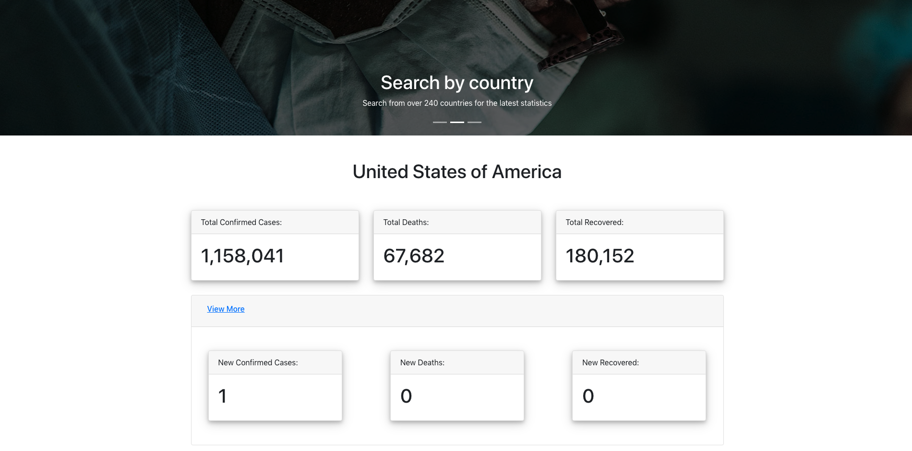

# Project 2 - CV Tracker

## Description 

CV Tracker is an application that allows users to see the global stats for the current coronavirus pandemic. Users can also search by country to see each individual country's statistics. All the stats are current and up to date via the COVID19 API and is aimed at allowing users to keep up with the current global situation in clear and simple way.





## Technologies 

The technologies in this project include: 

- ReactJS
- React Router
- React Bootstrap
- Styled Components (Library for maintainable stylings)
- COVID19 API where all the information is pulled from

## Getting Started 

To get started, navigate over to (https://cv-tracker19.herokuapp.com/) where the global stats will first appear. Use the search bar below to search by country. If you're not too sure what the exact country name is or due to the API storing countries by different name, there is also a Countries page included where a full list of countries is displayed.

## Installation Instructions 

- Fork and clone this repo to your CLI
- Run ``` npm install ``` to install the needed dependencies 
- Once complete, feel free to open up the folder in your code editor and run ``` npm start ``` to set up a test server

## Contribution Guidelines

This application is currently only for project submission but if you have any suggestions or ideas for better user accessibility feel free to submit a pull request or issue on this repo. 